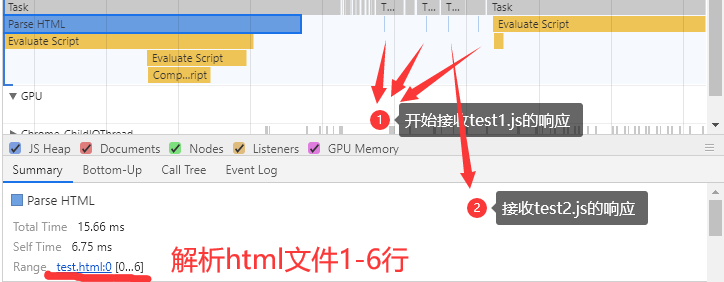
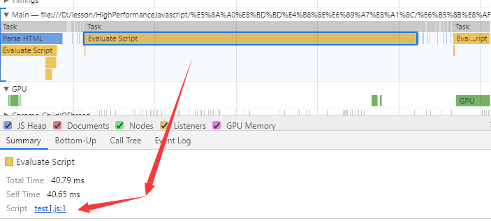
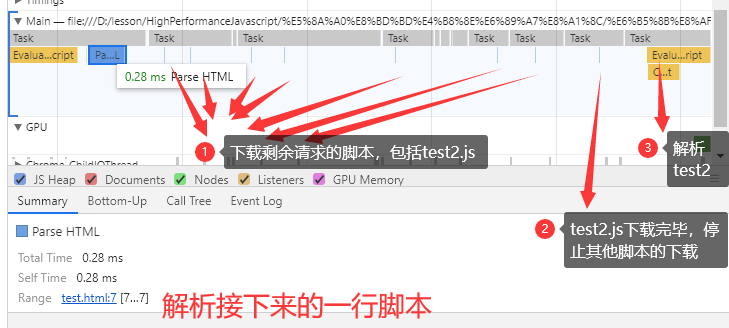
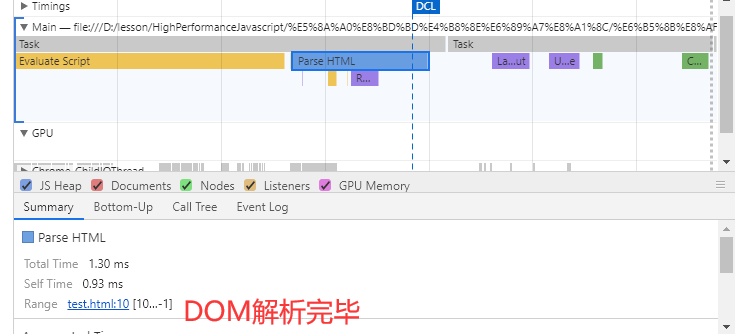

# 案例1——纯JS脚本

案例1的`html`代码在本目录下，如下：

```html
<!DOCTYPE html>
<html lang="en">
<head>
    <meta charset="UTF-8">
    <meta name="viewport" content="width=device-width, initial-scale=1.0">
    <meta http-equiv="X-UA-Compatible" content="ie=edge">
    <title>Document</title>
    <script src="test1.js"></script>
    <script src="test2.js"></script>
    <script src="test3.js"></script>
    <script src="test4.js"></script>
</head>
<body>
</body>
</html>
```

是4个有序的头部脚本，现在对它们的具体执行情况和加载情况进行探讨。

## 脚本解析流程

如图，我们可以看到4个脚本是按序进行请求的，而且是在一开始载入`html`文件时(此时并未开始解析`dom`)，就开始进行请求。


(此时图中的`Parse HTML`实际只解析了`DOM`的`0-6`行)
___
待`html`文件解析到第7行，我们正式遇到第一个脚本`test1.js`，此时浏览器会阻塞，直到`test1.js`下载完毕，然后开始解析`test1.js`，如图



我们可以从图中知道，接收`test1.js`过程中也对其他脚本进行了接收，但即使接收完毕也不会进行解析。
____
待`test1.js`下载完毕后，于是继续按从上到下的顺序解析`dom`结构，此时遇到`test2.js`，又停止解析`dom`，开始接收剩余的`test2.js`文件(这个期间涉及到对剩余脚本的同时下载)，直到全部接收后，开始执行`test2.js`，如图：



之后的脚本如此往复，直到test4.js解析完毕，最后将剩余的dom一次性解析完毕，如图


## 总结

1. 在纯脚本解析过程中，`Chrome`浏览器会在最开始接收完毕`html`文件后，按`TCP`连接最大个数，对其中的文本进行请求。

2. 待`DOM`解析到对应脚本位置时，会开始接收最初建立连接的脚本的数据。待当前对应位置脚本接收完毕后，停止其他脚本响应的接收，并开始解析当前脚本，这整个过程都将**阻塞`DOM`的解析**。解析完毕后，重复步骤2。

3. `DOM`解析完毕。
