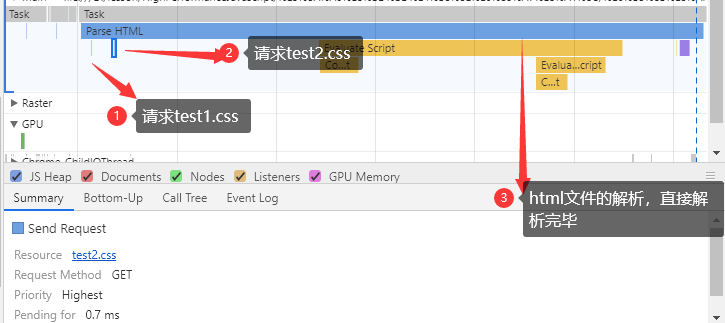
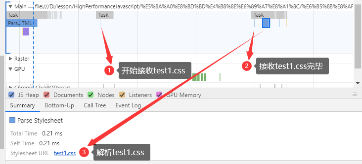
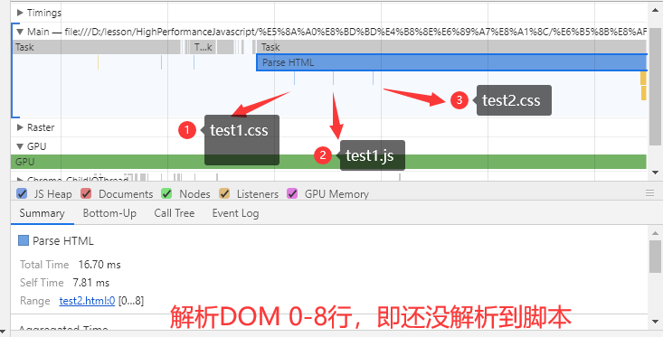
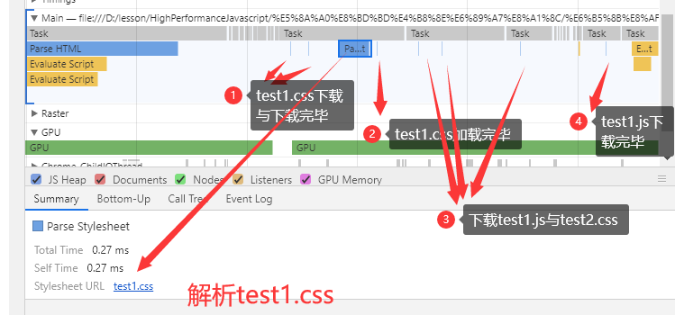
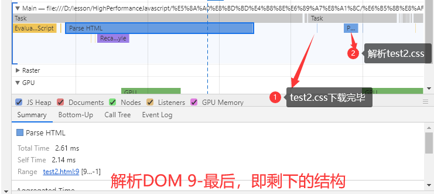

# 案例2——纯CSS

本测试案例具体代码文件在同目录下，具体的`html`结构为：

```html
<!DOCTYPE html>
<html lang="en">
<head>
    <meta charset="UTF-8">
    <meta name="viewport" content="width=device-width, initial-scale=1.0">
    <meta http-equiv="X-UA-Compatible" content="ie=edge">
    <title>Document</title>
    <link rel="stylesheet" type="text/css" href="test1.css">
    <link rel="stylesheet" type="text/css" href="test2.css">
</head>
<body>
    <div></div>
    <p></p>
</body>
</html>
```

这次与案例1有一些不同，虽然浏览器仍在未解析之前到脚本位置之前，按序发出了请求。与案例1不同的是，本次DOM的解析并未受到堵塞，直接解析完毕，如图：


待`DOM`解析完毕后，便开始下载`test1.css`，下载完毕后便开始解析：


之后`test2.css`也重复上述步骤，之后便进行重绘和重排，进行布局。

## 案例3——特殊情况，JS混合CSS

假如有以下情况，那么CSS会按何种方式进行加载和解析呢？

```html
<!DOCTYPE html>
<html lang="en">

<head>
    <meta charset="UTF-8">
    <meta name="viewport" content="width=device-width, initial-scale=1.0">
    <meta http-equiv="X-UA-Compatible" content="ie=edge">
    <title>Document</title>
    <link rel="stylesheet" type="text/css" href="test1.css">
    <script src="test1.js"></script>
    <link rel="stylesheet" type="text/css" href="test2.css">
</head>

<body>
    <div></div>
    <p></p>
</body>

</html>
```

还是老规矩，浏览器一开始即使未解析到脚本，也会开始提前请求脚本，如图：


当`DOM`解析到第9行时，遇到了`css`外链脚本，此时`DOM`的解析被阻塞了，并开始接收`test1.css`文件，直到接收完毕，然后解析`test1.css`，之后便继续下载其余的脚本，直到`test1.js`下载完毕，后开始运行`test1.js`。

____

运行完`test1.js`后，`dom`恢复解析，一直解析至完毕，然后继续下载`test2.css`，然后解析`test2.css`，整个过程就结束了。


## 提问

为什么外链`CSS`文件时，如果后面有`JS`文件，会强制进行`JS`文件之前的`CSS`的下载与解析？

答：为了得到`DOM`中元素最新的样式信息，防止`JS`文件中操作`DOM`样式信息时不为真实的样式信息。

## 总结

- `CSS`脚本并不会阻塞`DOM`的解析，但是如果`CSS`脚本后有`JS`脚本，则会在解析`JS`脚本之前，强制对该`CSS`脚本进行下载和解析后，才会执行`JS`脚本，即**会阻塞JS脚本**。
- 一般情况下，`CSS`脚本会在`DOM`解析完成后开始解析。
